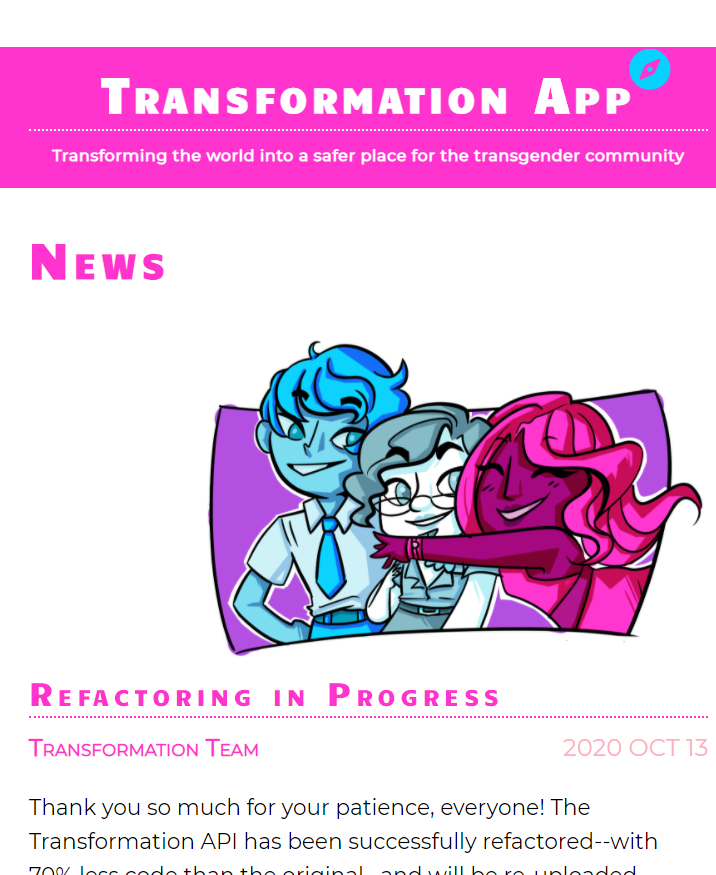
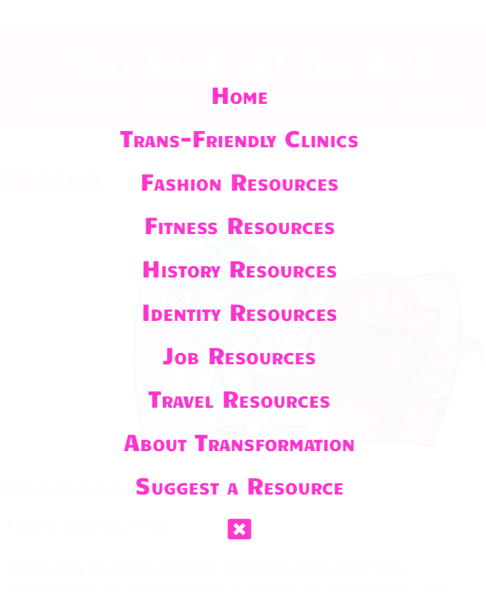
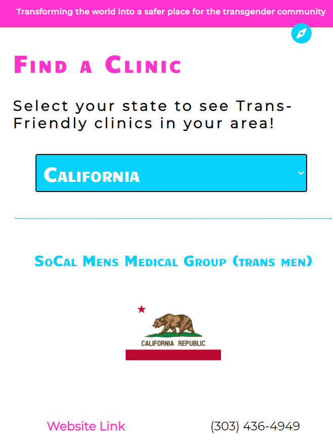

# TRANSFORMATION APP (V2)

## FRONT END (React)

### [Back End](https://github.com/themarkfullton/transformation-api-v2) (Golang)

**LINK TO LIVE:** https://transformation-app-v2.herokuapp.com/

**LINK TO OLD:** https://github.com/themarkfullton/the-transformation-app

**STILL UNDER CONSTRUCTION**

Full Stack. Transforming the world into a safer place for the transgender community! App/API containing a variety of transgender resources (from trans-friendly clinics to information about how to change one's given name)!

## Technologies Used

React, Sass, Axios (to connect with Golang API)

## Motivation

Finding up-to-date resources as a transgender individual is tough, but essential: It can sometimes mean the difference between life and death. This app was created for the purpose of making this information readily availiable; to transform the world into a better place for transgender individuals.

## Future Plans

The database is still being updated with resources (especially clinics). Also, the API will be receiving authentication and CRUD functionality.

Finally, I hope to add a "Transgender Community" collection filled with meeting groups from around the states.

## Resource Recommendations

If you're a transgender individual and you have resources you'd like to add to the API, shoot me an e-mail at the.mark.fullton@gmail.com . I'd appreciate it.

**Hopefully this application makes your life at least a little easier!**

## Screenshots

